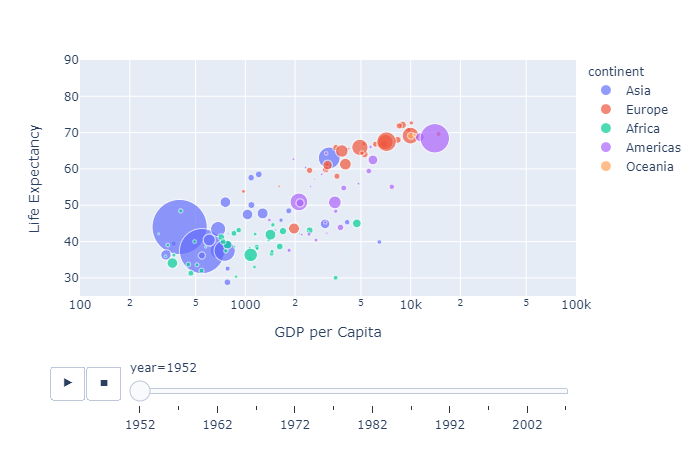

# Visualization-with-Plotly-Express
This Project consist of animation of beautiful, interactive data visualization of GDP per Capita vs Life Expectancy of Countries.

Plotly Express is a high-level Python visualization library: it’s a wrapper for Plotly.py that exposes a simple syntax for complex charts.

We can make richly interactive plots in just a single function call, including faceting, maps, animations, and trendlines. It comes with on-board datasets, color scales and themes, and just like Plotly.py

Here i have "Visualized Data with Plotly Express" where I have Customized charts, animations, and demonstrated various plotly.express features.

In this project we can see
-> How countries have evolved from the year 1952 all the way to 2007
-> The trend that is common to all the countries is that the Average Life Expectancy increases and so does the Income.
